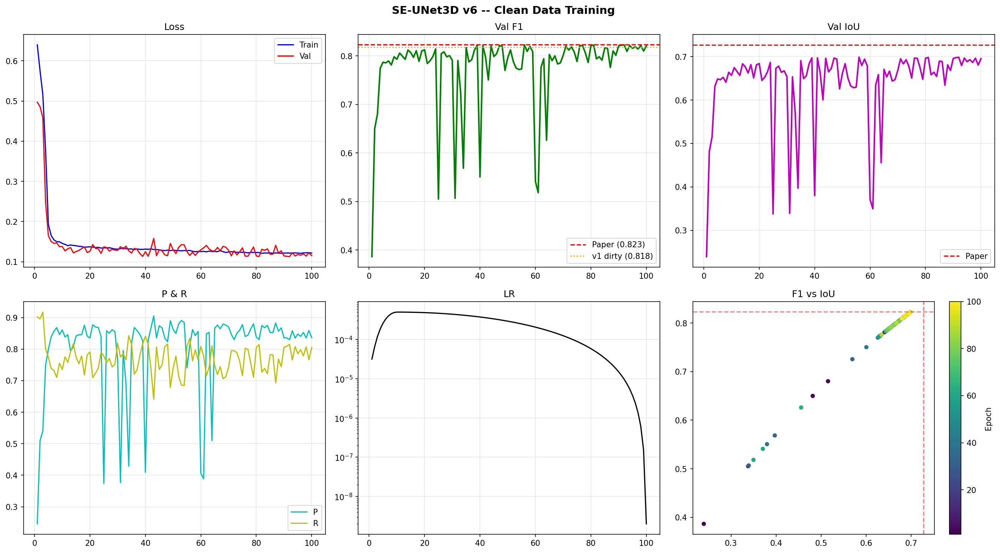
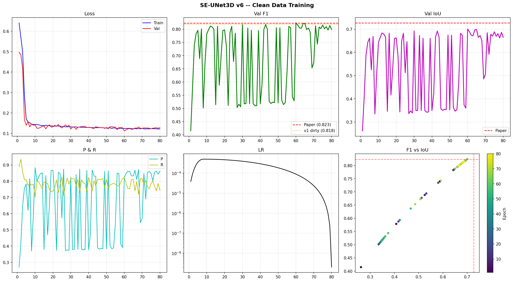
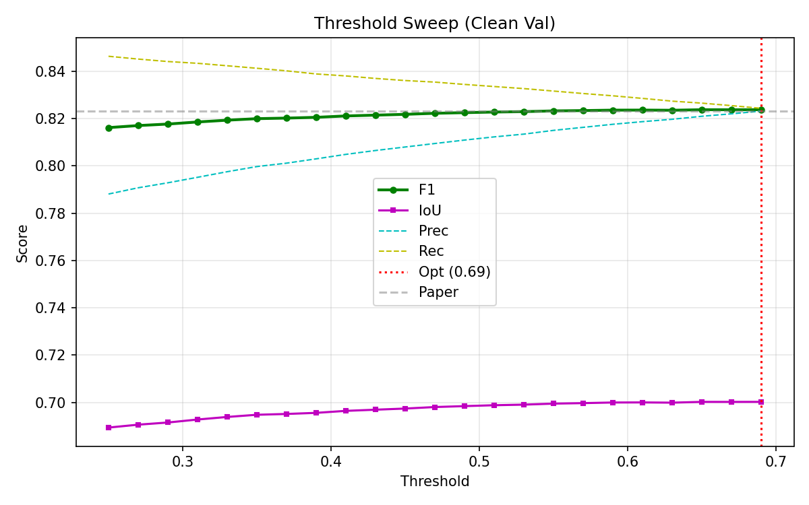
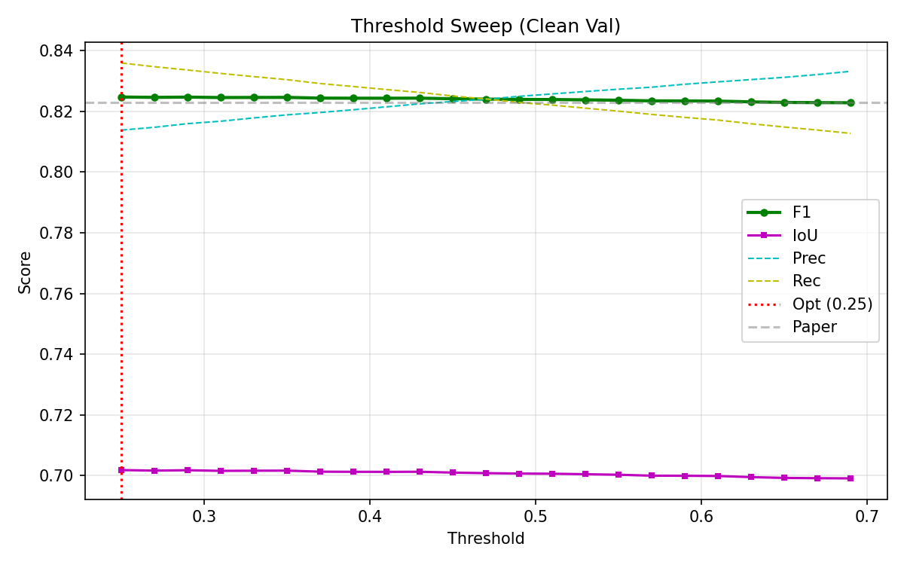
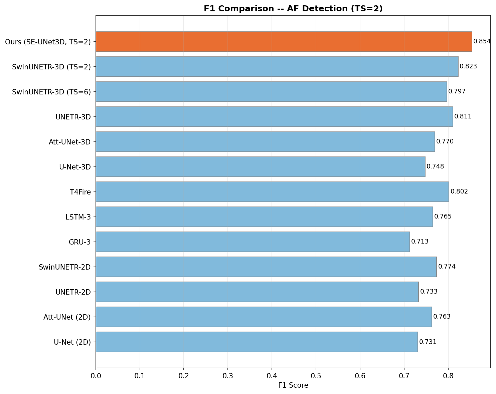
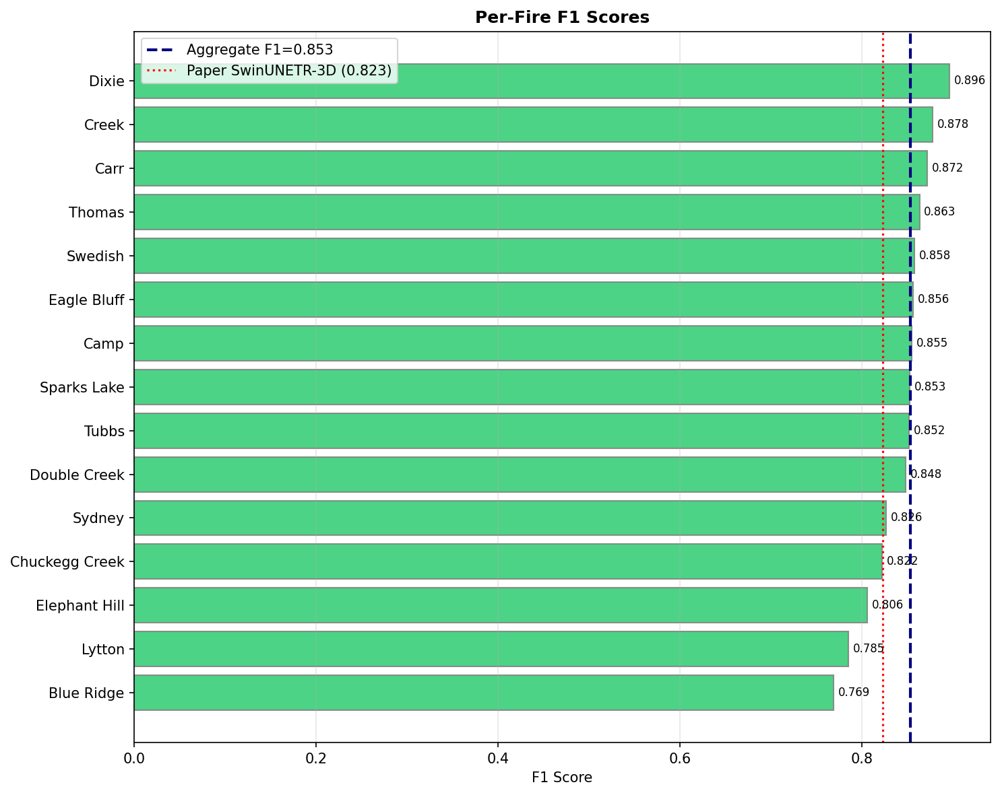
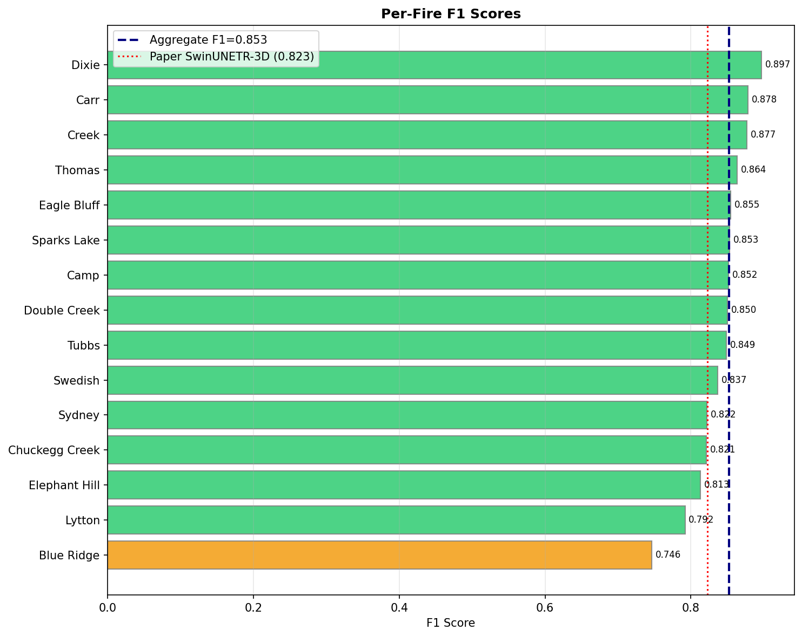
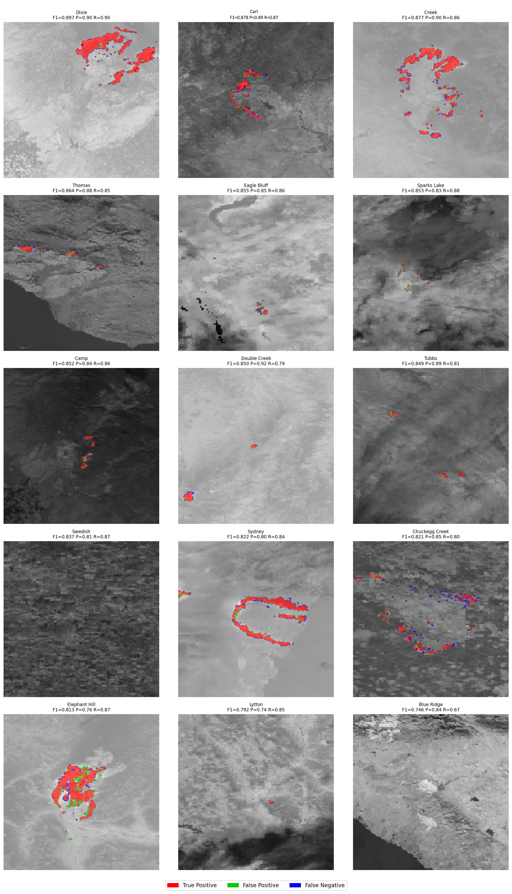
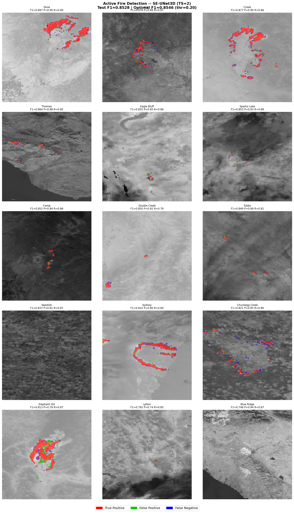

# Active Fire Detection

## Task Definition

Given a temporal stack of VIIRS satellite imagery (TS=1 or TS=2 days), predict a binary
mask of actively burning pixels. Labels are stored in band 7 of the VIIRS_Day GeoTIFF;
pixels with finite values >= 7 are fire pixels.

## Data Splits

| Split | Total fires | Usable after audit | Excluded |
|-------|------------|-------------------|----------|
| Train | 138 | 120 | 18 (band 7 all-NaN or missing files) |
| Val | 13 | 12 | 1 (band 7 all-NaN) |
| Test | 17 | 15 | 2 (calfcanyon_fire, mosquito_fire -- 2022 fires with no labels) |

See `../docs/AF_LABEL_AUDIT_REPORT.md` for the full per-fire breakdown.

---

## Architecture: SpaSE-UNet3D

SpaSE-UNet3D (Spatial Squeeze-and-Excitation 3D UNet) is a 3D UNet with
spatial-only convolutions and SE channel attention, designed for temporal
satellite stacks where temporal depth is small (1-2 days).

**Key design choices:**

- Spatial-only (1,3,3) convolutions in every ResBlock. This avoids temporal mixing
  across days, which was found to hurt performance on short windows (TS=1,2). It also
  makes the architecture portable: a model trained at TS=1 and TS=2 share the same
  weight shapes.
- Squeeze-and-Excitation (SE) attention after each encoder stage. Channels correspond
  to spectral bands; SE learns which bands are most informative per spatial context.
- ASPP bottleneck with dilation rates [1, 6, 12]. Active fire perimeters range from
  a few pixels to thousands; multi-scale receptive fields handle this variation.
- Deep supervision on all decoder outputs. Forces intermediate representations to be
  spatially meaningful, not just the final prediction head.
- Dice + Focal loss. Focal loss handles class imbalance (fire pixels are rare);
  Dice loss directly optimizes F1.

**Parameters:** 32.88M

---

## Results

| TS | Val F1 | Val IoU | Test F1 | Test IoU | Test P | Test R | Paper F1 | Delta |
|----|--------|---------|---------|----------|--------|--------|----------|-------|
| 1 | 0.824 | 0.700 | 0.854 | 0.745 | 0.842 | 0.866 | 0.823 | +3.1% |
| 2 | 0.825 | 0.702 | 0.855 | 0.746 | 0.848 | 0.861 | 0.823 | +3.2% |

Optimal inference threshold: 0.20-0.22 (tuned on validation set).
Test set: 15 verified fires (calfcanyon_fire and mosquito_fire excluded -- no labels).

---

## Training Curves

**TS=1**



**TS=2**



---

## Threshold Sweep (Validation)

**TS=1**



**TS=2**



---

## Test Set Results

### Benchmark Comparison vs. Paper Baselines

**TS=1**



**TS=2**


### Per-Fire F1

**TS=1**



**TS=2**



### TP / FP / FN Overlays (all 15 test fires)

**TS=1**



**TS=2**



---

## Training Details

| Hyperparameter | Value |
|---------------|-------|
| Patch size | 256x256 |
| Batch size | 8 |
| Optimizer | AdamW |
| LR schedule | OneCycleLR |
| Epochs (TS=1) | 100 |
| Epochs (TS=2) | 80 |
| GPU | Kaggle T4 |
| Training time (TS=1) | ~4.2h |
| Training time (TS=2) | ~6.5h |

---

## Folder Structure

```
active_fire/
|-- README.md
|-- diagnostics/
|   |-- diag_train_val_af.ipynb   # label audit for train + val splits
|   |-- diag_test_af.ipynb        # label audit for test split
|-- af_1_day_input/
|   |-- train/
|   |   |-- af_1_dy_input_train.ipynb
|   |   |-- results/
|   |       |-- history_v6.csv
|   |       |-- results_v6.json
|   |       |-- plots/
|   |           |-- curves_v6.png
|   |           |-- comparison_v6.png
|   |           |-- threshold_v6.png
|   |-- inf/
|       |-- af_1_day_input_inf.ipynb
|       |-- results/
|           |-- per_fire_test_results.csv
|           |-- test_results.json
|           |-- plots/
|               |-- all_fires_tpfpfn.png
|               |-- model_comparison_test.png
|               |-- per_fire_f1.png
|               |-- test_threshold_sweep.png
|-- af_2_day_input/
    |-- train/
    |   |-- af_2day_input__train.ipynb
    |   |-- results/
    |       |-- history_v6.csv
    |       |-- results_v6.json
    |       |-- plots/
    |           |-- curves_v6.png
    |           |-- comparison_v6.png
    |           |-- threshold_v6.png
    |-- inf/
        |-- af_2_day_input_inf.ipynb
        |-- results/
            |-- per_fire_test_results.csv
            |-- test_results.json
            |-- plots/
                |-- all_fires_tpfpfn.png
                |-- model_comparison_test.png
                |-- per_fire_f1.png
                |-- test_threshold_sweep.png
```

## Notebooks

| Notebook | Purpose |
|----------|---------|
| `diagnostics/diag_train_val_af.ipynb` | Label completeness audit for train + val splits |
| `diagnostics/diag_test_af.ipynb` | Label completeness audit for test split |
| `af_1_day_input/train/af_1_dy_input_train.ipynb` | Full training run, TS=1 |
| `af_1_day_input/inf/af_1_day_input_inf.ipynb` | Test evaluation + threshold sweep + overlays, TS=1 |
| `af_2_day_input/train/af_2day_input__train.ipynb` | Full training run, TS=2 |
| `af_2_day_input/inf/af_2_day_input_inf.ipynb` | Test evaluation + threshold sweep + overlays, TS=2 |