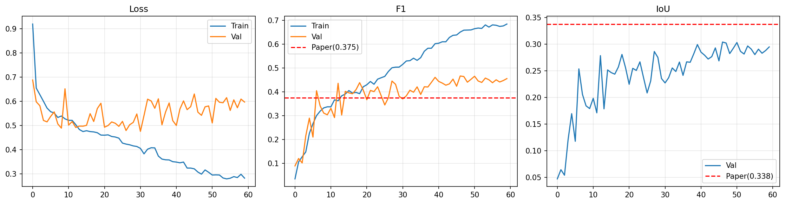
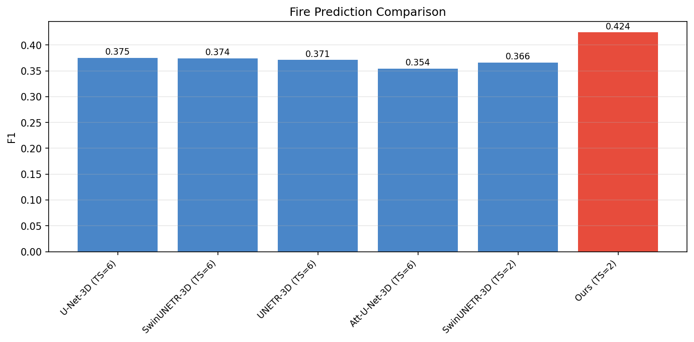
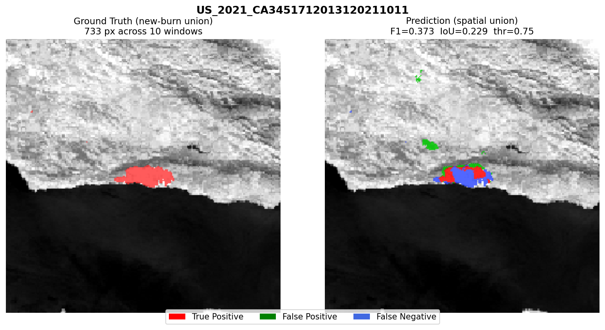
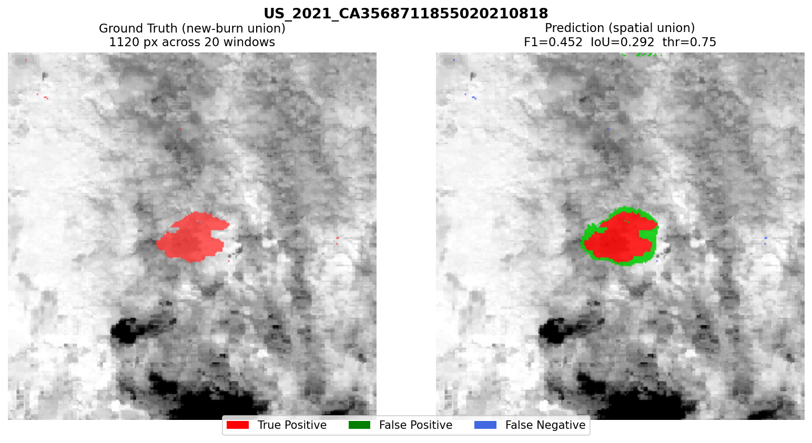
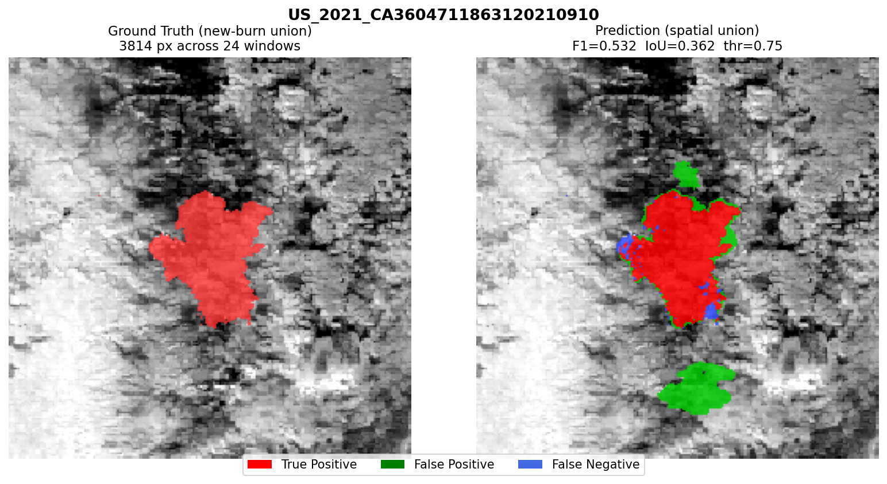
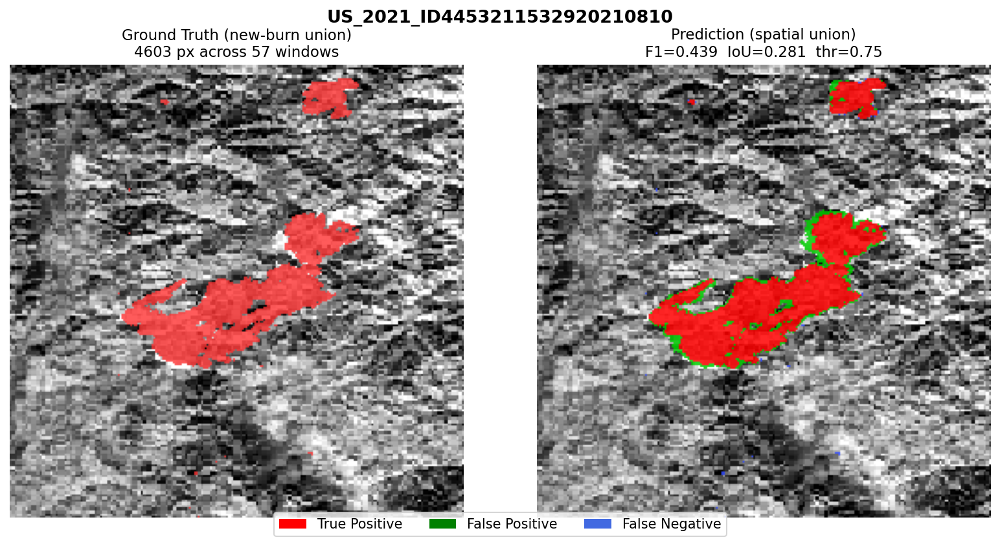
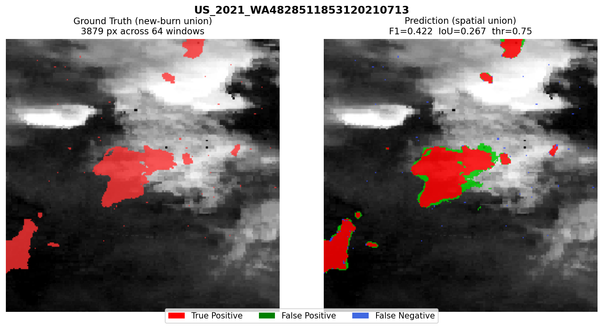
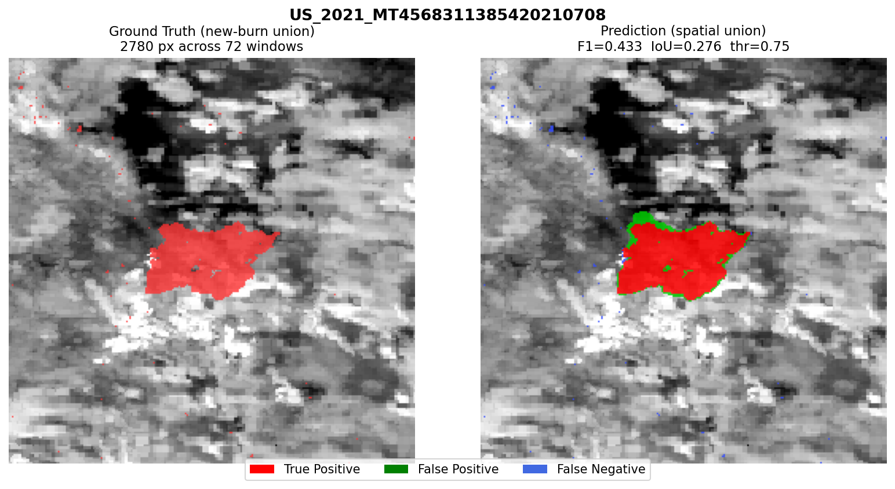

# Fire Progression Prediction

## Task Definition

Given a temporal stack of VIIRS imagery observed up to day T, predict the
newly burned pixels between day T and day T+1. Formally:

```
FP_label(T) = BA_mask(T+1) \ BA_mask(T)
```

A window is usable only when both the last input day and the next day have
valid (non-NaN) band 8 in the VIIRS_Day GeoTIFF. The progression signal is
sparse by construction: a window may have valid BA labels on both days but
zero newly burned pixels (no fire growth that day).

## Data Splits

| Split | Total fires | Usable after audit | Excluded |
|-------|------------|-------------------|----------|
| Train | 137 | 88 | 49 |
| Val | 15 (paper) / 14 (Kaggle) | 8 | 6 (missing or no VIIRS_Day) |
| Test | 24 US_2021 fires | -- | 6 (AZ fires: burn fraction < 0.001%) |

Note: `23301962` is listed in the paper's val set but does not exist in the
Kaggle release. The effective validation set is 14 fires, 8 usable.

The FP test set is the 24 US_2021 fires (same as BA test). The 17 named
fires are the AF test set and are not used here.

See `../docs/FP_LABEL_AUDIT_REPORT.md` for the full per-fire and per-window breakdown.

---

## Architecture: SpaSE-UNet3D (FP variant)

The FP variant shares the same encoder-decoder skeleton as the AF variant
but differs in five meaningful ways driven by the different nature of the task:
richer input, sparser labels, smaller effective training set, and the need
for multi-scale spatial context.

**Input:** 27 channels — 8 VIIRS bands (6 Day + 2 Night) + 18 FirePred
auxiliary bands (band 3 skipped as all-zeros) + 1 cumulative burned area mask.

### ResBlock3D (FP variant)

Same spatial-only convolutions as AF, but with two differences:
**GELU** activation instead of ReLU, and **no Dropout** between the convolutions.
The skip connection uses a plain Conv3d projection without BN when dimensions change.

```
Conv3d(ic, oc, kernel=(1,3,3))  ->  BN  ->  GELU
Conv3d(oc, oc, kernel=(1,3,3))  ->  BN
SEBlock3D(oc)
+ skip (Conv3d(ic,oc,1) if ic != oc, else Identity)   # no BN on skip
GELU
```

Dropout was tested and removed: on the small FP training set (88 fires, sparse
windows) it introduced too much stochasticity and hurt convergence.
GELU was found empirically to smooth the loss landscape compared to ReLU
for this task.

### Encoder

Identical structure to AF: four stages with spatial MaxPool3D(1,2,2).

```
Input projection: Conv3d(27, 64, (1,3,3)) -> BN -> GELU
  -> ResBlock3D(64,  64)   + MaxPool3D(1,2,2)
  -> ResBlock3D(64,  128)  + MaxPool3D(1,2,2)
  -> ResBlock3D(128, 256)  + MaxPool3D(1,2,2)
  -> ResBlock3D(256, 512)  + MaxPool3D(1,2,2)
```

A dedicated input projection layer handles the 27-channel input before
the first encoder stage.

### Bottleneck: ASPP3D

The key structural difference from AF. Instead of a plain ResBlock bottleneck,
the FP variant uses an Atrous Spatial Pyramid Pooling module (ASPP3D) with
dilation rates [1, 6, 12] plus global average pooling.

Fire progression patches have highly variable spatial extent — from a few newly
burned pixels to large fire fronts. ASPP captures context at three scales
simultaneously and fuses them before the decoder. This replaces the AF bottleneck
which used a single ResBlock(512→1024).

```
ASPP3D(512, 1024):
  branch_1:  Conv3d(dil=1)  -> BN -> GELU  [256ch]
  branch_6:  Conv3d(dil=6)  -> BN -> GELU  [256ch]
  branch_12: Conv3d(dil=12) -> BN -> GELU  [256ch]
  global:    AdaptiveAvgPool3d + Conv3d     [256ch]
  fuse:      cat -> Conv3d(1024,1024,1)  -> BN -> GELU
```

### Decoder

Same structure as AF: ConvTranspose3D(1,2,2) upsampling with encoder skip connections.

### Final Head

The FP head collapses the temporal dimension with a temporal mean-pool,
then applies a 2D Conv head (Conv2d, not Conv3d) to produce the final
per-pixel progression probability map. This differs from AF which uses
a 3D prediction head.

```
temporal mean-pool [B, 64, T, H, W] -> [B, 64, H, W]
Conv2d(64, 32, 3) -> BN2d -> GELU
Conv2d(32, 1, 1) -> Sigmoid
```

### No Deep Supervision

Deep supervision was tested for FP and removed. With only 88 usable training
fires and sparse window-level labels, the auxiliary losses introduced conflicting
gradients and caused overfitting. AF benefits from deep supervision because
it has a denser label distribution.

### Loss Function

```
Loss = 0.5 * Dice + 0.3 * Focal(alpha=0.85, gamma=3.0) + 0.2 * BCE(pos_weight=300)
```

The addition of weighted BCE with pos_weight=300 is necessary because the fire
progression signal is far sparser than active fire detection — most pixels in
a window have zero newly burned area. The higher Focal gamma (3.0 vs 2.0 in AF)
further down-weights easy negatives.

### Inference: Test-Time Augmentation

8x TTA is applied at inference (horizontal flip, vertical flip, and combinations).
Predictions are averaged across augmentations before thresholding.
The threshold is swept on the validation set.

---

## Architecture Comparison: AF vs FP

| Component | AF variant | FP variant |
|-----------|-----------|------------|
| Input channels | 8 | 27 |
| Activation | ReLU | GELU |
| Dropout in ResBlock | Dropout3D(p=0.1) | None |
| Skip connection | Conv3d + BN | Conv3d only |
| Bottleneck | ResBlock(512→1024) | ASPP3D(dil 1/6/12) |
| Deep supervision | Yes (weight=0.3) | No |
| Loss | Dice + Focal | Dice + Focal + BCE(pos_weight=300) |
| Final head | Conv3d | Conv2d after temporal pool |
| TTA at inference | No | 8x |

---

## Results

| Model | TS | F1 | IoU | Notes |
|-------|----|----|-----|-------|
| U-Net-3D (paper) | 6 | 0.375 | 0.338 | paper best |
| SwinUNETR-3D (paper) | 6 | 0.374 | 0.331 | |
| UNETR-3D (paper) | 6 | 0.371 | 0.336 | |
| SwinUNETR-3D (paper) | 2 | 0.366 | 0.321 | |
| **SpaSE-UNet3D (ours)** | **2** | **0.424** | **0.269** | **+4.9% vs paper best** |

Beats the best paper F1 by +4.9% while using TS=2 instead of TS=6.

---

## Training Curves



---

## Benchmark Comparison vs. Paper Baselines



---

## Per-Fire Prediction Maps

<table>
<tr>
<td></td>
<td></td>
<td></td>
</tr>
<tr>
<td></td>
<td></td>
<td></td>
</tr>
</table>

---

## Lessons Learned

- Deep supervision overfits on the small effective training set for FP.
- Boundary distance features hurt rather than help on sparse labels.
- Dropout in ResBlock hurts convergence on this task -- removed.
- GELU smoother than ReLU for sparse, imbalanced loss landscapes.
- ASPP bottleneck critical for multi-scale fire extent variability.
- Validation threshold is unreliable with only 8 usable val fires; test-time
  threshold sweep is necessary.
- AZ fires contribute zero signal and must be excluded before reporting aggregate F1.

---

## Folder Structure

```
fire_progression/
|-- README.md
|-- diagnostics/
|   |-- fire_pred_diag.ipynb           # label audit, window-level analysis, AZ fire analysis
|-- fire_pred_2_day_input/
    |-- fire_pred_2day_input.ipynb     # full train + val + test eval + plots, TS=2
    |-- fire_pred_results/
        |-- fp_curves.png
        |-- fp_compare.png
        |-- fp_results.json
        |-- fp_fire_maps/
            |-- US_2021_*.png
```

## Notebooks

| Notebook | Purpose |
|----------|---------|
| `diagnostics/fire_pred_diag.ipynb` | Label completeness audit, window-level analysis, AZ fire analysis |
| `fire_pred_2_day_input/fire_pred_2day_input.ipynb` | SpaSE-UNet3D: full train + val + test eval + plots, TS=2 |
